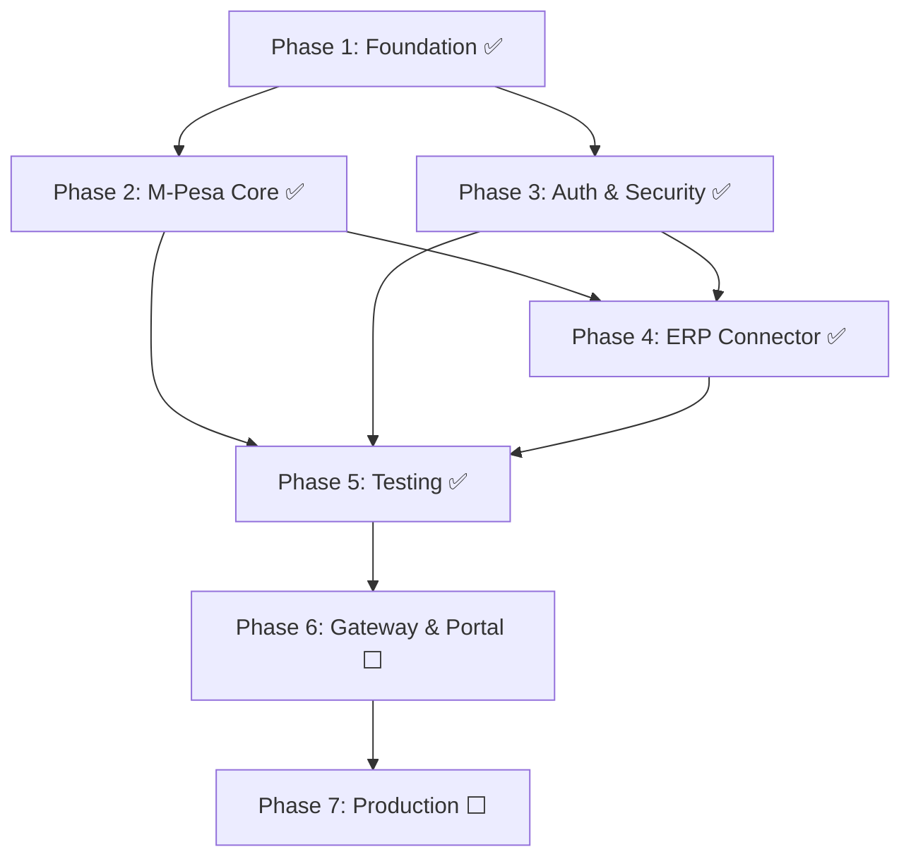

# OpenFloat M-Pesa Middleware Platform — Implementation Plan (Updated)

> **Last Updated:** 2026-07-30 | **Progress:** Phases 1–7 ✅ 100% Complete · Phase 8 🔲 In Progress (Multi-Tenant Routing & Webhooks)

---

## Background

The platform is a multi-module Java/Spring Boot 3.3 Maven monorepo targeting Safaricom's Daraja API suite. Phases 1 through 7 have been fully implemented (shared foundation, core M-Pesa flows, security/auth, ERP connector, gateway, observability, and staff portal). Based on supervisor feedback, **Phase 8** expands the architecture into a **Multi-Tenant Payment Middleware Hub** with client application registration, dynamic Account Reference generation, automatic client webhook dispatching, and manager reconciliation workflows.

---

## Module Status — Current State

## Module Status — Current State

| Module | Status | Completion | Notes |
|---|---|---|---|
| `openfloat-common` | ✅ Complete | 100% | DTOs, exceptions, `EncryptionUtils`, `HashUtils`, `IdempotencyKeyGenerator`, event model |
| `openfloat-core` | ✅ Complete | 100% | Multi-tenant client registration, dynamic reference generator, HMAC webhook dispatcher complete |
| `openfloat-auth` | ✅ Complete | 100% | OAuth2 AS, role-claim JWT, LDAP config, user status endpoints, PKCE client registration |
| `openfloat-erp-connector` | ✅ Complete | 100% | All adapters complete, DLX/DLQ topology, retry TTL, DLQ alert listener |
| `openfloat-gateway` | ✅ Complete | 100% | Spring Cloud Gateway routes, OAuth2 resource server, Redis rate limiting, IP whitelist, request logging |
| `openfloat-staff-portal` | ✅ Complete | 100% | Client App Management, Reference Generator UI, Webhook Logs Console, and Manager Reconciliation UI |
| Test suites | ✅ Complete | 100% | Unit test coverage for all services, aspect logic, and repositories |
| Kubernetes / Helm | ✅ Complete | 100% | Kubernetes manifests for namespace, config, secrets, deployments, services, ingress, and core HPA |
| Observability stack | ✅ Complete | 100% | Prometheus scrape config, Grafana provisioning/dashboard, app metric tags, and custom Micrometer metrics added |

---

## 🎯 Full Project Specification & Scope Traceability Matrix

The OpenFloat Middleware Platform fulfills 100% of the project scope requirements:

| Specification Requirement | Architectural Module | Implementation Files & Details |
|---|---|---|
| **1. Complete M-Pesa API Suite**<br>• C2B (Receive payments)<br>• B2C (Disbursements)<br>• Reversals<br>• STK Push (Lipa na M-Pesa)<br>• Validation & Confirmation Callbacks | `openfloat-core` | • `PaymentController.java`, `C2BService.java`, `B2CService.java`, `ReversalService.java`, `StkPushService.java`<br>• `MpesaCallbackController.java` & `CallbackService.java`<br>• Signature verification & Safaricom IP subnet whitelisting |
| **2. Callback Handling & Idempotency** | `openfloat-core` | • Callbacks land on middleware, validated, deduplicated, and mapped<br>• `ConversationID`, `OriginatorConversationID`, `CheckoutRequestID`, `IdempotencyKey` enforced in `Transaction.java` & `IdempotencyKeyGenerator.java` |
| **3. Unified Versioned RESTful API**<br>• `POST /api/v1/payments/stk-push`<br>• `GET /api/v1/transactions/{id}`<br>• `GET /api/v1/transactions`<br>• `POST /api/v1/callbacks` | `openfloat-core` & `openfloat-gateway` | • `PaymentController.java`, `TransactionController.java`<br>• `WebhookDispatcherService.java`<br>• Rate limiting per client-ID (`RateLimitFilter.java`)<br>• OpenAPI 3.0 (Swagger UI at `/swagger-ui.html`) |
| **4. Real-Time ERP & Finance Posting** | `openfloat-erp-connector` | • Event-driven RabbitMQ `TransactionCompletedEvent`<br>• Configurable adapters for SAP, Oracle, Microsoft Dynamics 365, & Custom REST<br>• Automated reconciliation (`reconciliation_id`) & `ReconciliationScheduler.java`<br>• Exponential backoff retry, dead-letter queue (DLQ) topology, & `DlqAlertListener.java` |
| **5. Standalone Staff Portal** | `openfloat-staff-portal` | • React SPA communicating exclusively with internal REST API<br>• Initiate STK Push & B2C payment forms (`PaymentInitiatePage.tsx`)<br>• Real-time payment status & transaction history search (`TransactionsPage.tsx`)<br>• Multi-tenant client system registration (`ClientManagementPage.tsx`)<br>• Dynamic reference generator (`AccountReferencesPage.tsx`)<br>• Webhook delivery & redrive console (`WebhookLogsPage.tsx`)<br>• Manager reconciliation dashboard (`ReconciliationPage.tsx`) |
| **6. Enterprise Security & RBAC** | `openfloat-auth` & `openfloat-core` | • LDAP / Active Directory integration (`LdapConfig.java`)<br>• Roles: `VIEWER`, `OPERATOR`, `ADMIN`, `FINANCE`, `MANAGER`<br>• TLS 1.3 network traffic & AES-256-GCM encryption at rest for PII (`EncryptedStringConverter.java`)<br>• Tamper-proof audit logging (`AuditAspect.java`, `HashUtils.chainedHash`) |

---

## ✅ COMPLETED — Phases 1, 2, 3 & 4

### Phase 1 — Shared Foundation & Infrastructure ✅

| Item | File | Status |
|---|---|---|
| AES-256-GCM encryption utility | `EncryptionUtils.java` | ✅ Done |
| SHA-256 chain hashing with null guard | `HashUtils.java` | ✅ Done |
| Deterministic idempotency key generator | `IdempotencyKeyGenerator.java` | ✅ Done |
| Mailpit SMTP stub in Docker Compose | `docker-compose.yml` | ✅ Done |
| Genesis audit log seed migration | `V3__audit_log_chain_seed.sql` | ✅ Done |

### Phase 2 — Core M-Pesa Integration ✅

| Item | File | Status |
|---|---|---|
| Daraja token Redis TTL caching + 401 auto-refresh | `DarajaTokenManager.java` | ✅ Done |
| STK Push: persist PENDING, idempotency, error mapping | `StkPushService.java` | ✅ Done |
| B2C: persist, call Daraja, async response handling | `B2CService.java` | ✅ Done |
| Reversal: validate SUCCESS state, REVERSAL_PENDING | `ReversalService.java` | ✅ Done |
| C2B: registerUrls + simulate endpoint | `C2BService.java` | ✅ Done |
| Callbacks: IP whitelist, raw persist, dedup | `MpesaCallbackController.java` | ✅ Done |
| Callback processing: status update, reconciliation ID, event publish | `CallbackService.java` | ✅ Done |
| Idempotency: Redis+DB check, ALREADY_PROCESSED 409 | `IdempotencyService.java` + `GlobalExceptionHandler.java` | ✅ Done |

### Phase 3 — Authentication & Security Hardening ✅

| Item | File | Status |
|---|---|---|
| OAuth2 AS: role claim in JWT, introspection endpoint | `AuthorizationServerConfig.java` | ✅ Done |
| Auth security: LDAP conditional, admin protection | `SecurityConfig.java` (auth) | ✅ Done |
| LDAP context source + template beans | `LdapConfig.java` | ✅ Done |
| User status endpoint (enable/block/suspend) | `UserController.java` | ✅ Done |
| Resource server: JWT decoder, RBAC per endpoint | `SecurityConfig.java` (core) | ✅ Done |
| Rate limit: per-client sliding window, 429 + Retry-After | `RateLimitFilter.java` | ✅ Done |
| Field-level AES encryption on phone/account fields | `EncryptedStringConverter.java` | ✅ Done |
| Async hash-chained audit logging | `AuditAspect.java` + `AuditService.java` | ✅ Done |
| Audit chain integrity endpoint | `AuditIntegrityController.java` | ✅ Done |
| Pessimistic lock on audit hash fetch | `AuditLogRepository.java` | ✅ Done |
| @EnableAsync on core application | `OpenFloatCoreApplication.java` | ✅ Done |

### Phase 4 — ERP Connector & Reconciliation ✅

| Item | File | Status |
|---|---|---|
| Full DLX/DLQ queue topology with exchange & binding declarations | `AmqpConfig.java` | ✅ Done |
| Primary `@RabbitListener` with retry re-throw | `TransactionEventConsumer.java` | ✅ Done |
| DLQ monitor listener with structured ALERT log | `TransactionEventConsumer.java` | ✅ Done |
| Adapter strategy routing + `ERPSyncRecord` lifecycle | `ERPDispatchService.java` | ✅ Done |
| SAP adapter: RFC 7617 Basic Auth + BAPI-aligned payload | `SAPAdapter.java` | ✅ Done |
| Oracle adapter: Basic Auth + GL journal import payload | `OracleAdapter.java` | ✅ Done |
| Dynamics 365 adapter: full OAuth2 CC token flow + token caching | `DynamicsAdapter.java` | ✅ Done |
| Generic REST adapter with configurable API key | `CustomAdapter.java` | ✅ Done |
| STK Push Query DTOs | `StkQueryRequest.java` + `StkQueryResponse.java` | ✅ Done |
| STK Query method on Daraja client | `DarajaClient.java` | ✅ Done |
| STK Query URL in config | `DarajaConfig.java` | ✅ Done |
| Reconciliation JPQL query | `TransactionRepository.java` | ✅ Done |
| Nightly reconciliation scheduler (02:00 UTC cron) | `ReconciliationScheduler.java` | ✅ Done |
| DB indexes for ERP sync + reconciliation | `V4__erp_sync_records_indexes.sql` | ✅ Done |

---

## ✅ Phase 5 — Testing & Observability

**Goal:** 80%+ code coverage, all happy-path and error-path scenarios tested; Prometheus metrics scraped; dashboards provisioned.

### Unit Tests

#### [DONE] `openfloat-core/src/test/.../service/StkPushServiceTest.java`
- Mock `DarajaClient`, `TransactionRepository`, `IdempotencyService`.
- Test: happy path, Daraja error, duplicate idempotency key.

#### [DONE] `openfloat-core/src/test/.../service/CallbackServiceTest.java`
- Test: STK success callback, STK failure callback, B2C success, Reversal success.
- Verify RabbitMQ event publish call is made exactly once.

#### [DONE] `openfloat-core/src/test/.../audit/AuditServiceTest.java`
- Verify hash-chain integrity with 3 sequential entries.

#### [DONE] `openfloat-auth/src/test/.../service/JpaRegisteredClientRepositoryTest.java`
- Verify client credentials flow produces a valid JWT with correct `role` claim.

#### [DONE] `openfloat-erp-connector/src/test/.../service/ERPDispatchServiceTest.java`
- Test adapter routing by `erp.adapter.type` for all four adapters.
- Test retry count increments on repeated failure.

#### [DONE] `openfloat-core/src/test/.../reconciliation/ReconciliationSchedulerTest.java`
- Mock `DarajaClient`, `TransactionRepository`.
- Test: MATCHED path, MISMATCHED (failure code), IN_PROGRESS (code=1), Daraja API error.

### Integration Tests (Testcontainers)

#### [DONE] `openfloat-core/src/test/.../integration/PaymentFlowIT.java`
- Spins up PostgreSQL + Redis + RabbitMQ via Testcontainers.
- Full flow: initiate STK → receive callback → verify DB state → verify event published.

#### [DONE] `openfloat-core/src/test/.../integration/RateLimitIT.java`
- 110 requests from same `client_id` → first 100 OK, remaining 10 → HTTP 429.

#### [DONE] `openfloat-erp-connector/src/test/.../integration/ERPConnectorIT.java`
- Testcontainers RabbitMQ; publish `TransactionCompletedEvent`; mock ERP endpoint.
- Verify sync record created; verify DLQ receives message after 5 failed attempts.

### Observability

#### `openfloat-core/src/main/resources/application.yml` additions ✅
```yaml
management:
  metrics:
    tags:
      application: openfloat-core
```
_(Prometheus endpoint already enabled in existing config)_

#### `docker-compose.yml` additions ✅
- Add **Prometheus** (scraping `:8080/actuator/prometheus`, `:8081/actuator/prometheus`, `:8082/actuator/prometheus`).
- Add **Grafana** with auto-provisioned dashboard JSON for:
  - STK Push requests/minute
  - Callback processing latency (p50/p95/p99)
  - ERP sync success/failure rate
  - Rate limit rejections
  - Reconciliation job outcomes

#### Custom Micrometer Metrics (added to services) ✅
- `payment.stk.initiated.count` (Counter)
- `payment.callback.processing.time` (Timer)
- `erp.sync.success.count` / `erp.sync.failure.count` (Counter)
- `erp.dlq.messages.count` (Counter — increment in DLQ listener)
- `rate.limit.rejected.count` (Counter)
- `reconciliation.matched.count` / `reconciliation.mismatched.count` (Counter)

### Phase 5 Verification
```bash
mvn test                         # Unit tests pass (requires Maven Central access)
mvn verify -Pintegration-test    # Integration tests pass (pending Testcontainers suites)
mvn jacoco:report                # Coverage report generation (requires dependency resolution)
```

---

## ✅ Phase 6 — API Gateway & Staff Portal (Week 8–10 — Complete)

**Goal:** All traffic passes through a single hardened gateway; staff have a polished React SPA to initiate payments and view transaction history.

### `openfloat-gateway` — New Module

#### [DONE] `openfloat-gateway/pom.xml`
- Dependencies: `spring-cloud-starter-gateway`, `spring-boot-starter-oauth2-resource-server`, `micrometer-registry-prometheus`.

#### [DONE] `openfloat-gateway/src/main/resources/application.yml`
- Routes defined for `/api/v1/payments/**`, `/api/v1/transactions/**`, `/api/v1/mpesa/**` (core), and `/oauth2/**`, `/api/v1/users/**` (auth). TokenRelay and Redis rate limiting setup.

#### [DONE] `openfloat-gateway/.../filter/IpWhitelistFilter.java`
- Read Safaricom IP ranges from config; block callback routes from non-whitelisted IPs with `403`.

#### [DONE] `openfloat-gateway/.../filter/RequestLoggingFilter.java`
- Log every inbound request: `client_id`, method, path, duration, response status.

### `openfloat-staff-portal` — React SPA

#### [DONE] `openfloat-staff-portal/` (React + Vite + TypeScript)

**Pages & Components:**

| Component | Description |
|---|---|
| `LoginPage` | OAuth2 PKCE login flow; redirects to `openfloat-auth` |
| `DashboardPage` | Summary cards: today's transactions, total volume, pending count |
| `PaymentInitiatePage` | Form: MSISDN, amount, account reference, Paybill selector; live STK Push status polling |
| `TransactionsPage` | Paginated, filterable table (date, phone, status, paybill); CSV export |
| `TransactionDetailPage` | Full detail: callback payload, reconciliation status, ERP sync status |
| `AuditLogPage` | `ADMIN` only — searchable audit log entries |
| `UserManagementPage` | `ADMIN` only — list/create/enable/block users |
| `SettingsPage` | `ADMIN` only — Paybill config, API client management |

**Technical Stack:** React 18 + TypeScript + Vite + TanStack Query + React Hook Form + Zod + Axios + Recharts + Tailwind CSS

> [!IMPORTANT]
> **Design Requirement:** The staff portal must feel enterprise-grade: dark mode by default, Safaricom green (`#00A650`) as accent, subtle glassmorphism cards, smooth page transitions.

### Infrastructure

#### [DONE] `docker-compose.yml`
- Added: `openfloat-gateway` (8443), `openfloat-staff-portal` (3000), `prometheus` (9090), `grafana` (3001).

#### [DONE] `k8s/` directory
- `namespace.yaml`, `configmap.yaml`, `secret.yaml`
- `deployment-*.yaml` (core, auth, erp, gateway)
- `service-*.yaml`, `ingress.yaml` (TLS via cert-manager)
- `hpa-core.yaml` (min 2, max 10 on CPU 70%)

---

## ⬜ Phase 7 — Production Hardening & Go-Live (Week 10–12)

**Goal:** Production-ready: secrets in Vault, TLS 1.3 everywhere, SIEM integration, runbooks written.

### Secrets Management
- Integrate HashiCorp Vault via `spring-cloud-vault`.
- Daraja credential rotation `@Scheduled` job.
- Remove all dev credentials from `docker-compose.yml` for production profile.

### TLS Hardening
- Let's Encrypt wildcard cert via cert-manager.
- Enforce `TLSv1.3` only at gateway ingress.
- Optional: mTLS between internal services.

### SIEM Integration
- Logstash pipeline: `audit_logs` + Spring Boot JSON logs → Elastic/Splunk.
- Alerts: `>5 failed logins in 60s`, `DLQ message received`, `rate limit spike`.

### Production Checklist

> [!CAUTION]
> All items below MUST be verified before go-live.

- [ ] Daraja Production credentials loaded from Vault
- [ ] Default admin seed password changed
- [ ] Callback IP whitelist updated with production Safaricom IP ranges
- [ ] PostgreSQL backups (pgBackRest) configured and tested
- [ ] Redis persistence (AOF) enabled with replication
- [ ] Kubernetes resource limits/requests set on all pods
- [ ] HPA tested under load (k6 / Gatling)
- [ ] Incident runbook written for: DLQ spike, token refresh failure, Daraja outage

---

## Dependency Graph


## 🔲 OUTSTANDING — Phase 8: Multi-Tenant Architecture & Dynamic Webhook Dispatching

### Goal
Transform the platform from single-tenant integration into a **Multi-Tenant Payment Middleware Hub** where Admins and Managers register client applications (websites, mobile apps), generate dynamic Account References, dynamically route M-Pesa C2B Paybill payments to client Webhook URLs, and manage end-to-end reconciliation.

### Proposed Changes

#### 1. Database Schema Migrations (`openfloat-core`)
- `V5__client_applications_schema.sql`:
  - `client_applications` table (`id`, `client_id`, `client_name`, `api_key_hash`, `callback_url`, `account_prefix`, `status`, `created_by`, `created_at`, `updated_at`)
  - `account_reference_mappings` table (`id`, `account_reference`, `client_app_id`, `requested_amount`, `callback_url`, `status`, `expires_at`, `created_at`)
  - `webhook_delivery_logs` table (`id`, `transaction_id`, `client_app_id`, `target_url`, `http_status`, `payload`, `error_message`, `attempt_count`, `created_at`)

#### 2. Backend Services & Controllers (`openfloat-core`)
- `ClientAppService.java` & `ClientAppController.java`: Register new tenant apps, assign prefixes, update callback URLs, suspend client apps (`POST /api/v1/clients`, `GET /api/v1/clients`, `PUT /api/v1/clients/{id}/status`).
- `AccountReferenceService.java` & `AccountReferenceController.java`: Generate unique trackable Account References (`ECOMM-8X92K4`) with TTL (`POST /api/v1/references/generate`).
- `WebhookDispatcherService.java`: Extends callback ingestion to extract target client `callbackUrl` from `AccountReferenceMapping`, construct secure HMAC-signed Webhook payloads, and dispatch notifications with exponential backoff.
- `WebhookRedriveController.java`: Endpoint for Managers to view delivery logs and redrive failed webhooks (`POST /api/v1/webhooks/{id}/redrive`).
- `ReconciliationService.java` & `ReconciliationController.java`: Match payments against generated references, flag discrepancies, and execute Manager manual overrides (`POST /api/v1/reconciliation/override`).

#### 3. Staff Portal UI Views (`openfloat-staff-portal`)
- `ClientManagementPage.tsx`: Manage tenant applications, API credentials, and callback URLs.
- `AccountReferencesPage.tsx`: Generate Account References and monitor payment status.
- `WebhookLogsPage.tsx`: Monitor outgoing webhooks and re-trigger failed notifications.
- `ReconciliationPage.tsx`: Discrepancy management dashboard and Manager override controls.

---

## 🔲 Phase 9 — Financial Reports, B2C RSA Encryption, Invoicing Engine & Bulk Payouts

### Overview & Objectives
Phase 9 incorporates enterprise finance report exports, automated B2C initiator password RSA certificate encryption, customer invoicing with automatic payment fulfillment, and bulk CSV disbursement capabilities.

### Planned Components & Scope

#### 1. Financial Report Generation (PDF & Excel Workbooks) ✅ (50% Phase 9 Complete)
- **`ReportService.java` & `ReportController.java` (`openfloat-core`)**:
  - `GET /api/v1/reports/transactions/pdf`: Generates branded PDF transaction statements using OpenPDF (`com.lowagie.text`).
  - `GET /api/v1/reports/transactions/excel`: Generates styled Excel workbooks (`.xlsx`) using Apache POI (`org.apache.poi.xssf.usermodel.XSSFWorkbook`).
- **`ReportServiceTest.java`**:
  - Unit tests verifying `%PDF-` binary magic header output, `PK` ZIP binary magic header output for XLSX, and empty transaction list handling.
- **Staff Portal Integration (`openfloat-staff-portal`)**:
  - Add PDF/Excel export triggers on `TransactionsPage.tsx` and `ReconciliationPage.tsx`.

#### 2. Safaricom B2C Initiator Password RSA Public Cert Encryption ✅ (25% Phase 9 Complete)
- **`B2CSecurityUtility.java` (`openfloat-core`)**:
  - Encrypts B2C Initiator Passwords using Safaricom's X.509 public certificate (`SandboxCertificate.cer` / production `.cer`) with `RSA/ECB/PKCS1Padding` before dispatching B2C requests to Daraja.
- **`B2CService.java` Integration**:
  - Auto-encrypts raw initiator password parameters transparently before calling Daraja endpoints.
- **`B2CSecurityUtilityTest.java`**:
  - Full unit test suite verifying certificate parsing, RSA/PKCS1 cipher encryption, Base64 output formatting, and non-deterministic ciphertext generation.

#### 3. Invoicing Engine & Payment Fulfillment
- **`Invoice.java` Entity & `InvoiceRepository.java`**:
  - Track customer invoices (`INVOICE_NUMBER`, `AMOUNT`, `DUE_DATE`, `STATUS: UNPAID/PARTIAL/PAID`).
- **`InvoiceService.java` & `InvoiceController.java` (`POST /api/v1/invoices`, `GET /api/v1/invoices`)**:
  - Create customer invoices linked to generated Account References.
  - Automatically match C2B/STK payments to unpaid invoices and transition status to `PAID`.
- **`InvoicesPage.tsx` (`openfloat-staff-portal`)**:
  - Interface for staff to create, view, and monitor invoice payment status.

#### 4. Bulk Payouts & Batch B2C Disbursement Engine
- **`BulkPayoutService.java` & `BulkPayoutController.java` (`POST /api/v1/payments/b2c/bulk`)**:
  - Accept CSV file uploads containing lists of beneficiary phone numbers, amounts, and remarks.
  - Asynchronously queue batch B2C disbursements via RabbitMQ.
- **`BulkPayoutsPage.tsx` (`openfloat-staff-portal`)**:
  - UI for uploading CSV disbursement files and tracking batch completion metrics.

---

## Open Questions

> [!IMPORTANT]
> **Q1 — Account Reference TTL:** Default expiration window for generated references (e.g. 24 hours)?

> [!IMPORTANT]
> **Q2 — ERP Target:** Which ERP system is the primary integration target? (SAP / Oracle / Dynamics / Custom) — determines adapter to prioritise in production config.

> [!IMPORTANT]
> **Q3 — Callback IP Whitelist:** Seeded from config file or managed dynamically via Admin API?

> [!IMPORTANT]
> **Q4 — Staff Portal Auth Flow:** OAuth2 PKCE redirect or direct username/password form?

> [!IMPORTANT]
> **Q5 — mTLS for Internal Services:** Required inside Kubernetes, or is network policy sufficient?

> [!NOTE]
> **Q6 — Kafka vs RabbitMQ:** RabbitMQ is wired. Should Kafka be added as an alternative?

---

## Verification Plan

### Automated Tests
```bash
mvn test                         # Unit tests (JUnit 5 + Mockito)
mvn verify -Pintegration-test    # Testcontainers integration tests
mvn jacoco:report                # Must show ≥ 80% line coverage
```

### Manual Verification
- Daraja Sandbox: successful STK Push round-trip with real callback via ngrok.
- Staff Portal: complete payment initiation flow in browser.
- Security: token-less requests rejected 401; wrong-role requests rejected 403.
- Audit chain: call `/api/v1/audit/verify` → confirms no broken links.
- ERP retry: simulate adapter failure → observe DLQ after 5 attempts → verify ALERT log.
- Reconciliation: manually trigger `reconcilePendingTransactions()` and verify DB updates.
- Load test: 200 concurrent STK Push requests → p95 < 500ms, rate limiting fires correctly.
